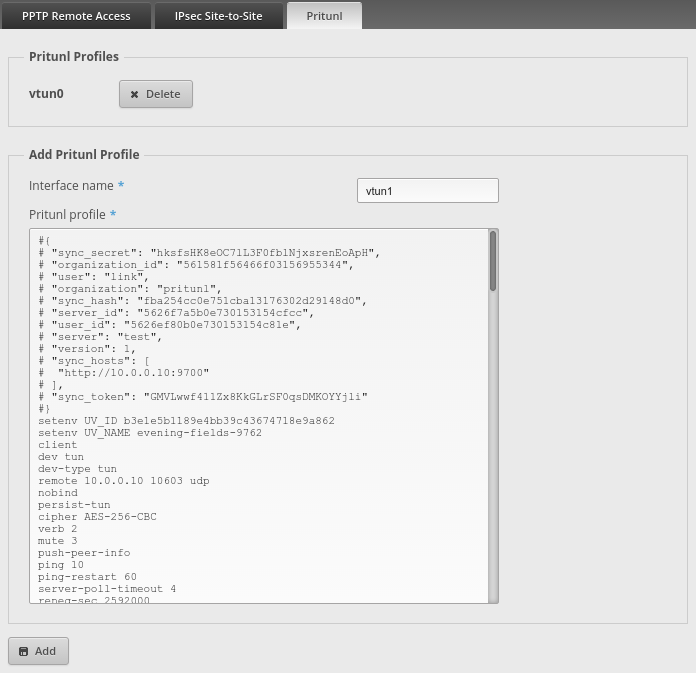

# pritunl-edgemax: Pritunl EdgeMax addon

Pritunl addon for [Ubiquiti](https://www.ubnt.com/) EdgeRouters, this will add
a Pritunl tab to the VPN section of the EdgeMax web console. The new section
will allow adding a profile by copying the contents of a Pritunl profile. The
addon will then parse the profile and create an openvpn interface in the `
interfaces->openvpn` section of the EdgeMax router configuration. The profiles
can also be removed in the new tab. The EdgeMax operating system already has
support for OpenVPN this addon is only used to improve the configuration
management for Pritunl profiles. The addon will only patch two web files for
the EdgeMax web interface and does not modify any critical system files or
install any additional software. There isn't any possibility of damaging the
router or otherwise making the router inaccessible or unusable. The addon can
be fully removed by running the remove script or by re-installing an EdgeMax
upgrade image.



### EdgeMax Routers

Below are two Ubuquiti EdgeRouters that are compatible with this addon. Both
are available on Amazon.

##### EdgeRouter X

[](http://www.amazon.com/gp/product/B00YFJT29C/ref=as_li_qf_sp_asin_il_tl?ie=UTF8&camp=1789&creative=9325&creativeASIN=B00YFJT29C&linkCode=as2&tag=pritunl-20&linkId=HSAPRM4CC524QR7A)

[](http://www.amazon.com/gp/product/B00YFJT29C/ref=as_li_qf_sp_asin_il_tl?ie=UTF8&camp=1789&creative=9325&creativeASIN=B00YFJT29C&linkCode=as2&tag=pritunl-20&linkId=HSAPRM4CC524QR7A)

##### EdgeRouter PoE

[](http://www.amazon.com/gp/product/B00E77N3WE/ref=as_li_qf_sp_asin_il_tl?ie=UTF8&camp=1789&creative=9325&creativeASIN=B00E77N3WE&linkCode=as2&tag=pritunl-20&linkId=SHG4FHGP4LE7ZH7T)

[](http://www.amazon.com/gp/product/B00E77N3WE/ref=as_li_qf_sp_asin_il_tl?ie=UTF8&camp=1789&creative=9325&creativeASIN=B00E77N3WE&linkCode=as2&tag=pritunl-20&linkId=SHG4FHGP4LE7ZH7T)

### Upgrade

Before installing the addon check that the router is running EdgeMax v1.7.0.
EdgeMax upgrades can be downloaded at
[ubnt.com/download/edgemax](https://www.ubnt.com/download/edgemax)

### Install

To install the addon first login to the cli of the router this can be done with
ssh or by clicking the cli in the top right of the web interface. Then
download the install script then run the script. This will first create a
backup of the original web files and then install the modified files. Once
complete reload the web interface and go to the VPN section to access the
Pritunl tab.

```
curl -O https://raw.githubusercontent.com/pritunl/pritunl-edgemax/master/build/pritunl-edgemax.sh
sh pritunl-edgemax.sh
```

# Uninstalling

To remove the addon login to the cli of the router with either ssh or the cli
in the web console then run the command below. Installing an EdgeMax upgrade
image will also remove the addon.

```
sh pritunl-edgemax.sh remove
```
