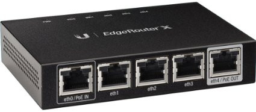
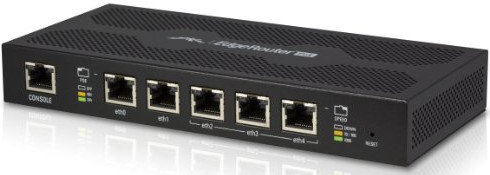
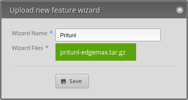
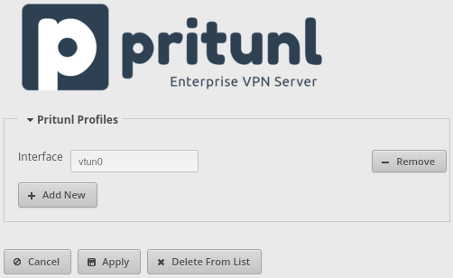

# pritunl-edgemax: Pritunl EdgeMax addon

Pritunl addon for [Ubiquiti](https://www.ubnt.com/) EdgeRouters. This addon
will add a new section to the Feature Wizards section of the EdgeMax web
console to easily add and managing Pritunl vpn profiles.

### EdgeMax Routers

Below are two Ubuquiti EdgeRouters that are compatible with this addon. Both
are available on Amazon.

##### EdgeRouter X

##### EdgeRouter PoE

### Install

To install the addon first download the
[plugin package](https://github.com/pritunl/pritunl-edgemax/raw/master/pritunl-edgemax.tar.gz).
Once the package is downloaded go to the Wizards tab
in the web console and select the + icon next to Features Wizards on the left
sidebar. Then name the Wizard "Pritunl", upload the plugin package and click
Save.

### Uninstall

To remove the addon click Delete From List on the Pritunl Wizard page.
